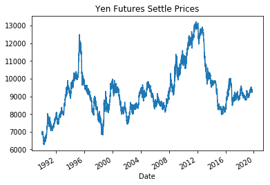

# HW-7-TimeSrs_YenFuture
Homework # 7 on Unit # 10 Time Series Yen for the Future

# Predicting future movements in the value of the Japenese Yen in relation to the US Dollar

This file accompanies Visual Data Analysis notebook being provided to my FinTech Company CFO.

## Goal of This Notebook 
The goal of these analysis tools is to provide information about Yen exchange rates.

### Part I - Time-Series Forecasting

I plotted the Settle price fluctuation of the Yen, from 1990 to today:

The patterns I noted were substantial volatility in the shorter-term, and an upward thrust in general over the long term.

In comparing the settle price to the trend line derived from the Hodrick-Prescott Filter, that upward direction is very clear.

I forecasted Returns using the ARMA model and the Settle Price using the ARIMA model - initial results yielded AIC (Akaike Information Criterion) and BIC (Bayesian Information Criterion) levels of approximately 15000 (ARMA) and 83000 (ARIMA) which argued against the usefulness of these models for trading without further iterations and improvements, as the current data has too many parameters. However in both cases the projections show an uptick in exchange rate futures. 

My GARCH Analysis results:

From GARCH my conclusion is that although there is significant volatility, the Japanese Yen's substantial upside makes it a worthwhile investment even so.

### Part II - Linear Regression Forecasting

# Technical Notes

## Libraries
This Jupyter Lab notebook utilizes the following libraries:

os

Pandas

Numpy

dotenv (just for comfort level)

Pathlib

matplotlib

## Data Inputs

Besides the elements related to those libraries, additional data to be input by the user includes their currency holdings, their stocks and bonds amounts, and their monthly income amounts.  

# Acknowledgements

I would like to first acknowledge the guidance and teaching of our FinTech Boot Camp Instructor, Garth Mortensen, our TA, Alejandro Esquivel, and out Student Success Manager, Angelica Baraona. I also found the collective Stack Overflow wisdom (especially the Quantitative Finance community) essential as ever. Regarding Time Series and Machine Learning overall I utilized information from the geeksforgeeks.org (again) website, as well as Jason Brownlee's '11 Classical Time Series Forecasting Methods in Python (Cheat Sheet)' page, 'Time Series Analysis in Python - A Comprehensive Guide with Examples' from the Machine_Learning_+ website, and the Dataquest website's tutorial 'Time Series Analysis with Pandas'; as well as the tech website collective in general. The Pandas books section on Time Series were helpful. And finally, Weapons of Math Destruction by Cathy O'Neil was a great source for context regarding modeling and the inherent challenges facing our communities.
